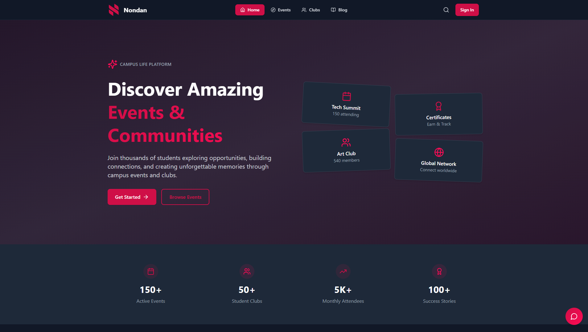

# Nondan Frontend



🎨 **Design**: [View on Figma](https://www.figma.com/design/TGEWoiUVvVJb5KE59obG7K/Nondan---Event-Management-Platform)

A modern, responsive frontend application for the Nondan event management platform built with React.js, Vite, and Tailwind CSS.

## ✨ Features

- **Modern UI/UX**: Clean, responsive design with dark/light theme support
- **Authentication**: Secure login/signup with JWT token management
- **Event Management**: Browse, search, filter, and register for events
- **Club Management**: Explore clubs, join/leave, and manage memberships
- **User Dashboard**: Personalized dashboard for students and admins
- **Admin Panel**: Complete admin interface for event and club management
- **Real-time Search**: Fast search functionality across events and clubs
- **Certificate Verification**: QR code-based certificate verification system
- **AI Chatbot**: Integrated AI assistant for user support
- **Responsive Design**: Mobile-first approach with full responsiveness
- **Theme System**: Dynamic dark/light mode switching
- **Toast Notifications**: User-friendly feedback system

## 🛠 Tech Stack

- **Framework**: React 19.1.1
- **Build Tool**: Vite 7.1.2
- **Styling**: Tailwind CSS 4.1.12
- **Routing**: React Router DOM 7.8.2
- **Icons**: Lucide React 0.468.0
- **Notifications**: React Toastify 11.0.5
- **State Management**: React Context API
- **Type Checking**: ESLint with React plugins
- **Deployment**: Vercel (configured)

## 📋 Prerequisites

Before running the application, make sure you have the following installed:

- [Node.js](https://nodejs.org/) (v16 or higher)
- [npm](https://www.npmjs.com/) or [yarn](https://yarnpkg.com/)
- Backend API running (see backend documentation)

## 🚀 Installation

1. **Clone the repository**
   ```bash
   git clone <your-repository-url>
   cd nondan_frontend
   ```

2. **Install dependencies**
   ```bash
   npm install
   ```

3. **Set up environment variables**
   ```bash
   cp .env.example .env.local
   # Edit .env.local file with your configuration
   ```

4. **Start the development server**
   ```bash
   npm run dev
   ```

The application will start running on `http://localhost:5173`

## 🔧 Environment Variables

Create a `.env.local` file in the root directory with the following variables:

```env
VITE_API_BASE_URL=http://localhost:5000/api
VITE_API_URL=http://localhost:5000
VITE_APP_NAME=Nondan
VITE_APP_VERSION=1.0.0
```

## 📜 Scripts

- `npm run dev` - Start development server with hot reloading
- `npm run build` - Build for production
- `npm run preview` - Preview production build locally
- `npm run lint` - Run ESLint for code quality checks

## 📁 Project Structure

```
nondan_frontend/
├── src/
│   ├── components/          # Reusable UI components
│   ├── pages/              # Page components
│   ├── context/            # React Context providers
│   ├── hooks/              # Custom React hooks
│   ├── assets/             # Static assets
│   └── styles/             # Global styles and theme
├── public/                 # Public assets
├── package.json           # Dependencies and scripts
└── README.md              # This file
```

## 🧩 Components

### UI Components
- **Button**: Customizable button with variants
- **Card**: Container component for content sections
- **Modal**: Reusable modal dialog system
- **Avatar**: User profile image component
- **Badge**: Status and category indicators
- **SearchBar**: Search input with filtering capabilities
- **LoadingSpinner**: Loading state indicator
- **ThemeToggle**: Dark/light mode switcher

### Layout Components
- **Navbar**: Main navigation with responsive menu
- **Footer**: Site footer with links and contact info
- **Sidebar**: Side navigation for dashboards

### Feature Components
- **EventCard**: Event display with registration functionality
- **ClubCard**: Club information display
- **Chatbot**: AI-powered assistance widget
- **ErrorBoundary**: Error handling wrapper

## 📄 Pages

### Public Pages
- **Home**: Landing page with featured events and clubs
- **Events**: Browse and search all events
- **Clubs**: Explore available clubs
- **EventDetail**: Detailed event information and registration
- **ClubDetail**: Club information and membership options
- **AuthPage**: Login and signup forms

### Protected Pages
- **Student Dashboard**: Personalized student interface
- **Admin Dashboard**: Administrative overview
- **Profile Management**: User profile and settings
- **Event Management**: Create and manage events (Admin)
- **Club Management**: Administer clubs and memberships (Admin)

## 🛣 Routing

The application uses React Router for navigation:

### Public Routes
- `/` - Home page
- `/events` - Events listing
- `/clubs` - Clubs listing
- `/auth/login` - Login page
- `/auth/signup` - Registration page

### Protected Routes
- `/student/*` - Student dashboard routes
- `/admin/*` - Admin dashboard routes (Admin role required)

## 🗂 State Management

The application uses React Context API for state management:

- **AuthContext**: User authentication and authorization
- **ThemeContext**: Dark/light mode theme switching

## 🎨 Styling

- **Tailwind CSS**: Utility-first CSS framework
- **Responsive Design**: Mobile-first approach
- **Dark Mode**: Built-in dark theme support
- **Custom Theme**: Defined color variables and design tokens

## 🚀 Deployment

### Vercel Deployment

The project is configured for Vercel deployment with `vercel.json` for proper client-side routing support.

```bash
npm run build
vercel --prod
```

## 🛠 Development Guidelines

### Code Style
- Use functional components with hooks
- Follow React best practices
- Maintain component purity when possible
- Use descriptive component and variable names

### File Naming
- Components: PascalCase (e.g., `EventCard.jsx`)
- Pages: PascalCase (e.g., `Dashboard.jsx`)
- Hooks: camelCase starting with 'use' (e.g., `useAuth.js`)

## 🤝 Contributing

1. Fork the repository
2. Create a feature branch (`git checkout -b feature/AmazingFeature`)
3. Follow the coding standards
4. Commit your changes (`git commit -m 'Add some AmazingFeature'`)
5. Push to the branch (`git push origin feature/AmazingFeature`)
6. Open a Pull Request

## 📄 License

This project is licensed under the MIT License.

## 📞 Support

For support, email hello@nondan.com or create an issue in the repository.

## 🔗 Related Projects

- [Nondan Backend](../nondan_backend) - Backend API for this application

---

**Happy Coding!** 🚀
